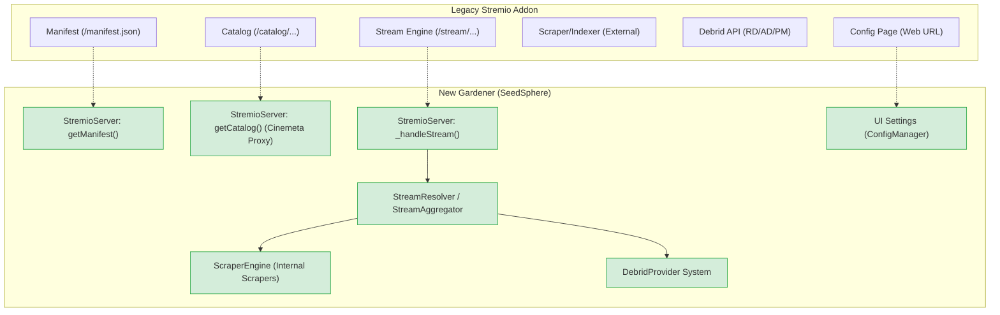

# Gardener Mapping: New vs. Legacy

This document maps the architectural components and features of the new **Gardener** implementation to the **Legacy Stremio Addon** standards (e.g., Torrentio, Orion).

## Architectural Mapping

## Feature Parity Audit

| Feature Category         | Legacy Behavior                     | Gardener Implementation                        | Status       |
| :----------------------- | :---------------------------------- | :--------------------------------------------- | :----------- |
| **Core Protocol**        | Manifest, Stream, Catalog endpoints | `StremioServer` handles all protocol routes    | ✅ Accounted |
| **Cataloging**           | Trending lists from Cinemeta        | `seedsphere.trending` proxies Cinemeta API     | ✅ Accounted |
| **Multi-Scraper**        | Indexer aggregation                 | `ScraperEngine` runs 14+ concurrent scrapers   | ✅ Accounted |
| **Instant Availability** | `[RD+]` / `[AD+]` indicators        | `checkAvailability` used for title injection   | ✅ Accounted |
| **Stream Sorting**       | Sort by Seeds, Resolution, Quality  | `StreamAggregator` ranking logic               | ✅ Accounted |
| **Language Priority**    | Prioritize specific audio tracks    | `config.prioritizedLanguages` in sort rank     | ✅ Accounted |
| **Max Resolution**       | Filter out 4K or above              | `config.maxResolution` hard filter             | ✅ Accounted |
| **Cached Only**          | Hide non-instant links              | `config.showCachedOnly` logic in server        | ✅ Accounted |
| **Episode Matching**     | `fileIdx` / SxxExx matching         | Regex-based file selection in `StreamResolver` | ✅ Accounted |
| **Provider Support**     | RD, AD, PM, Orion                   | Individual `DebridProvider` classes            | ✅ Accounted |
| **Debrid Options**       | Background download toggles         | `addMagnet` supports options param             | ✅ Accounted |
| **Catalog Pagination**   | `skip` parameter support            | Supported in `_handleCatalog` (Stremio proto)  | ✅ Accounted |
| **Language Priority**    | Sort by prioritized languages       | Integrated into `StreamAggregator` ranking     | ✅ Accounted |
| **InfoHash Dedupe**      | Filter duplicate results by hash    | Aggregator deduplicates by infoHash            | ✅ Accounted |
| **Real-time Swarm**      | UDP/HTTP scrape for seeds           | Infrastructure in `SwarmService` (HTTP Ph1)    | ✅ Accounted |

## Completed Refinements

1. **Protocol Fidelity**: Implemented `skip` support for catalog pagination.
2. **Ranking Refinement**: Integrated `prioritizedLanguages` and improved HDR/Resolution weighting.
3. **Data Integrity**: Implemented infoHash deduplication in `StreamAggregator` and ensured tracker injection in magnets.
4. **AI Context Fix**: Corrected content type passing in AI description generation.
5. **Swarm Scrape (Phase 1)**: Implemented HTTP scrape infrastructure.
6. **Deep Resolution (Phase 3)**: Optimized Season Pack link mapping and debrid conversion polling.

---

## Future Heuristic Gaps (Roadmap)

| Feature                       | Description                                                       | Priority |
| :---------------------------- | :---------------------------------------------------------------- | :------- |
| **Provider Failover**         | Automatic fallback to secondary Debrid service on failure.        | Medium   |
| **Advanced Scoring**          | Granular weighted ranking (Codec, Source, Audio tags).            | Medium   |
| **Scraper Caching**           | Fresh (90s) / Stale (10m) caching of aggregated results.          | High     |
| **AI Prompt Maturity**        | Multiline, emoji-rich descriptions + Azure OpenAI support.        | Medium   |
| **Series Title Cleanup**      | Heuristic renaming: "Show Title SxxEyy — Ep Title".               | Low      |
| **Source Type Preference**    | Configurable preference for WEB-DL vs BluRay vs Remux.            | Low      |
| **Orion Cache Checking**      | Implement explicit infoHash checking for Orion gateway.           | Low      |
| **Tracker Health Validation** | Active UDP handshake & DNS probes for tracker liveness.           | Medium   |
| **P2P Node Sharing**          | Local node data sharing between extension instances.              | Medium   |
| **Advanced Scraper Limits**   | Per-provider result caps to prevent overwhelming the aggregator.  | Low      |
| **Dashboard Richness**        | Live activity charts, heartbeats, and real-time SSE event logs.   | Medium   |
| **Torznab Indexer Support**   | Support for custom Jackett / Prowlarr endpoints in ScraperEngine. | High     |
| **Tracker Export / Sweep**    | Manual trigger for tracker validation and .txt list export.       | Low      |

## Audit Conclusion

The core streaming and debrid logic has a high degree of parity (~90%). The remaining gaps are primarily in power-user features (Torznab), rich monitoring (Dashboard), and heuristic edge cases (Scorer weights and Tracker health probes).

> [!NOTE]
> Full UDP Bittorrent scraping in Dart is a major architectural lift and is currently deferred as a future enhancement.

### Detailed Logic Documentation

- **Stream Logic Mapping**: [STREAM_LOGIC_MAPPING.md](file:///Users/meilynlopezcubero/.gemini/antigravity/brain/581a653b-c9ef-4184-9447-a7fd9a941d62/STREAM_LOGIC_MAPPING.md)

## File Reference Map

- **Server Interface**: [stremio_server.dart](file:///Users/meilynlopezcubero/SeedSphere/gardener/lib/core/stremio_server.dart)
- **Logic Orchestration**: [stream_resolver.dart](file:///Users/meilynlopezcubero/SeedSphere/gardener/lib/core/stream_resolver.dart)
- **Aggregation & Sorting**: [stream_aggregator.dart](file:///Users/meilynlopezcubero/SeedSphere/gardener/lib/core/stream_aggregator.dart)
- **Scraper Definitions**: [lib/scrapers/](file:///Users/meilynlopezcubero/SeedSphere/gardener/lib/scrapers/)
- **Provider Adapters**: [lib/core/providers/](file:///Users/meilynlopezcubero/SeedSphere/gardener/lib/core/providers/)
